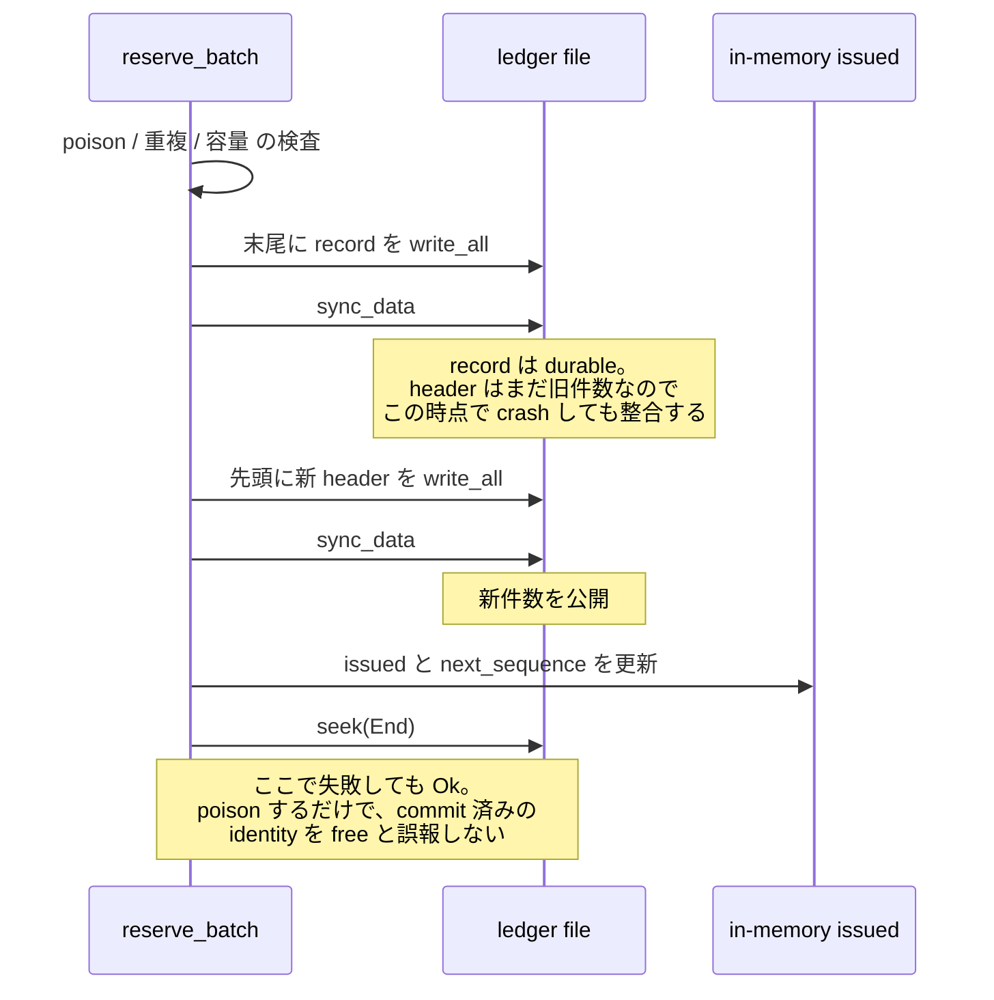

<!-- doc-type: concept -->

# identity と ledger

[Session orchestrator](README.md) / identity と ledger

> **対象読者:** identity の一意性をレビューする人、ledger file を運用する人

[`lib.rs`](../../crates/session-orchestrator/src/lib.rs) は session ごとに 7 つの 128-bit identity を抽選し、no-reuse ledger に予約してから backend を呼ぶ。ledger は on-disk format を持ち、破損と多重所有を検出する。

## 7 つの identity

| kind | on-disk tag | 何を指すか |
|---|---|---|
| `Vm` | 1 | Firecracker VM |
| `Session` | 2 | orchestrated session |
| `Subject` | 3 | VM 内の subject |
| `Workspace` | 4 | workspace clone |
| `Capability` | 5 | root capability |
| `Request` | 6 | lifecycle / Broker control request |
| `BrokerSession` | 7 | Broker connection |

**tag は永続 format の一部で、enum の discriminant ではない。** 値を入れ替えると、既存 ledger の record が別 domain として読まれる。

一意性は domain をまたぐ。同じ 16 bytes が 2 度現れることを、kind に関係なく拒否する。VM ID として使った値は、以後どの session でも subject ID にならない。

## 予約が先、side effect が後

`allocate_session_identity` が 7 値を抽選し、`ledger.reserve_batch` で予約してから `clone_workspace` を呼ぶ。順序の理由は[session の commit 順序](lifecycle.md#commit-の順序)。

重複検査は 2 方向。既に commit 済みの集合との照合と、同じ batch 内での照合。

```rust
if self.issued.contains(identity) || !pending.insert(*identity) {
    return Err(LedgerError::Duplicate { kind: *kind, identity: *identity });
}
```

後者が無いと、偏った、あるいは replay された entropy source が 1 回の session 内で同じ値を 2 度出しても通る。決定の背景は [ADR 0015](../decisions/0015-persist-the-identity-ledger-across-restarts.md)。

## on-disk format

| 定数 | 値 |
|---|---|
| `LEDGER_MAGIC` | `b"SORLEDG1"` |
| `LEDGER_VERSION` | `1` |
| `LEDGER_HEADER_BYTES` | `32` |
| `LEDGER_RECORD_BYTES` | `32` |
| `MAX_LEDGER_RECORDS` | `1_048_576` |
| `MAX_LEDGER_BYTES` | `33_554_464`（約 32 MiB） |
| checksum | CRC-32、reversed poly `0xEDB8_8320` |

header は magic、version、header 長、reserved、record 数、data 長、CRC-32。record は version、kind tag、reserved、sequence、identity、CRC-32。

1 session あたり 7 record なので、上限は 149,796 session。超えると `CapacityExceeded` を返し、以降の session が全部止まる。fail closed。

file 全体を `read_to_end` で memory に読むので、size の上限がそのまま allocation の上限になっている。

open 時の検査は 5 つ。

- header と全 record の CRC-32。bit rot が identity field を書き換えても検出する。
- record の sequence が 0 から連続していること。中間の record を消すと検出する。
- header が commit した data 長を超える trailing bytes が無いこと。crash で残った部分 record を黙って無視しない。
- 同じ 16 bytes が 2 度出ないこと。
- version が 1 であること。違えば `UnsupportedVersion` で、best-effort な parse はしない。

## 書き込みの durability 順序

```text
poison 検査
  -> 重複検査
  -> 容量検査
  -> record を末尾に write_all
  -> sync_data          ← record は durable、header はまだ古い commit 範囲
  -> header を先頭に write_all
  -> sync_data          ← 新しい件数を公開
  -> in-memory の issued と next_sequence を更新
  -> seek(End)          ← 失敗しても Ok。poison するだけ
```



**record の sync が header の write より前にある。** 逆にすると、crash 時に「header は N 件と言っているが実際は N-1 件」という file ができる。再 open すると `Truncated` になり、その identity は `issued` から落ちて再利用可能になる。ledger の存在意義がそこで消える。

2 つ目の `sync_data` までは、途中で失敗しても `issued` が durable な内容と一致する（あるいはその部分集合になる）。sync が終わった時点で予約は commit しているので、そこで in-memory を更新する。

## poison

書き込みか sync が不確かな結果になったら、その instance は `poisoned` になり、以降の予約を全部拒否する。

```rust
if self.poisoned {
    return Err(LedgerError::Unavailable { reason: "..." });
}
```

部分的に書けた batch の後、in-memory の `issued` と file が食い違う。続行すると、free だと思っている identity が既に disk 上にある（あるいは逆）状態で払い出す。

`Err` は「その identity がまだ free である」ことを意味する。両方の `sync_data` が終わった時点で予約は commit しており、そこから先の失敗で `Err` を返すと、disk 上に永久に残った値を caller が free だと解釈する。同じ値を再 open 後に retry すれば `Duplicate` になるので、`IdentityLedger` trait の doc と食い違う。そのため in-memory の更新を先に済ませ、最後の `seek(End)` が失敗しても `Ok` を返して poison だけする。次の append が未知の offset に書くことは、poison が止める。

**`poisoned` は process-local で永続しない。** restart すると fail-closed 状態が消える。復旧は `parse_ledger` が trailing suffix を見つけるかどうかだけに依存し、失敗した batch が disk に何も残さなかった場合、再起動した process はそれらの identity を free として扱う。

## 排他所有

`<ledger path>.lock` という sidecar file を `create_new` で作る。中身は所有 process の PID と改行。`ExclusiveLedgerLock::drop` が消す。

2 つの orchestrator process が同じ ledger を書くと、それぞれが自分の `issued` と `next_sequence` を持ち、衝突する offset に append し、両方が同じ identity を free だと信じる。

**この機構には制約がある。**

- `stale_lock` は Linux 以外では compile 時の no-op。crash した所有者の lock file を回収できない。
- Linux でも `/proc/<pid>` の存在しか見ない。PID が再利用されると、死んだ所有者が生きて見え、永久に `Locked` になる。
- `create_new` と PID の `write_all` の間で crash すると、0 byte の lock が残る。中身が parse できず、これも永久に `Locked`。operator が消すまで復旧しない。
- `flock` ではなく sidecar file なので、advisory であって強制ではない。

## path の検査

ledger path と lock path は、symlink でも非 regular file でもないことを確認する。open の前（`validate_ledger_path`）と後（`reject_non_regular_or_symlink`）の 2 回。

symlink を許すと、低権限の user が orchestrator の書き込みを自分の file へ向けられる。あるいは、orchestrator が write 権を持つ任意の host file に 32 byte の record を append させられる。

**ただし `O_NOFOLLOW` を使っていない。** 検査 2 回は別の syscall で、open 後の検査は fd が regular file であることを見るが、検証した inode と同じであることは見ない。その窓で path を差し替えると、append が別の regular file へ向く。

## checksum は MAC ではない

CRC-32 は破損の検出であって、改竄の検出ではない。ledger file に書ける者は、record を消して CRC を計算し直せる。identity を free pool に戻せる。

実際の防御は filesystem の permission と advisory な sidecar lock だけ。

## 何が助かるのか

identity の一意性が 1 つの file に集約されている。「この値は使われたか」を調べるのに、session の記録を横断しなくてよい。

on-disk format が固定長 record なので、破損した位置を offset で特定できる。`LedgerError::Corrupt` が offset と理由を持つ。

## 正確な保証範囲

- `SessionOrchestrator` 経由で `DurableIdentityLedger` を動かす test が無い。`tests/orchestration.rs` は in-memory ledger か failing stub を使い、`tests/ledger.rs` は durable ledger を直接叩く。`new_durable` はどの test からも呼ばれていない。
- crash consistency の主張が fault injection されていない。record の sync と header の write の間で process を落とす test は無い。「header が commit した範囲の外に trailing bytes がある」分岐は未検証。
- `poisoned` 経路を実 `DurableIdentityLedger` で起こす test が無い。mock が `WriteFailed` / `SyncFailed` を返すだけ。実際の write 失敗が、次の open で拒否される状態を残すことは示されていない。
- `CapacityExceeded` を起こす test が無い。定数の値を assert しているだけで、append 時、file size、header 宣言件数の 3 つの bound はいずれも未実行。
- stale lock の回収が未検証。既存 test は同じ process から 2 回 open するので `pid != std::process::id()` が偽になり、`/proc` を一度も見ない。cross-process の排他も、死んだ所有者からの復旧も未検証。
- 並行性の test が皆無。2 thread も 2 process も `open` / `reserve_batch` を競わせていない。排他の主張は sidecar file と `create_new` に依存していて、contention 下で検証されていない。
- `OsEntropy` を実行する test が無い。identity は `[0x01; 16]` のような決定的 mock から来る。`/dev/urandom` を開くこと、16 bytes 読むこと、予測不可能であることは、いずれも確認していない。
- `Symlink`、`NotRegularFile`、`UnsupportedVersion`、file 内 `Duplicate`、非連続 sequence、未知の kind tag、非ゼロ reserved はすべて未到達。

## 変更時の確認点

- `allocate_session_identity` は `draw_identities` に kind の列を渡し、結果を名前で分配する。**リストを 2 本に分けない。** 以前は `kinds` 配列と位置読みが独立していて、並べ替えると compile が通ったまま全 record の `IdentityKind` がずれ、Capability 用に引いた値が `broker_session_id` に入った。`zip` による切り捨てで 8 個目が黙って予約されないこともあった。現在はどちらも compile error になる。
- kind を増やすときは、`draw_identities` に渡す配列と分配側の `let [...]` を同時に直す。長さが合わなければ compile が通らない。
- `ledger_header` は `header[9] = 32` と literal を書き、`parse_ledger` は `LEDGER_HEADER_BYTES` と比較する。定数を変えると、自分が書いた file を読めなくなる。`header[28..]`、`record[28..]`、`checksum(&..[..28])` も offset 28 を hard-code しているので、`LEDGER_RECORD_BYTES` を上げると compile は通って実行時に `copy_from_slice` が panic する。
- `LEDGER_MAGIC` は末尾に format version の数字を持ち、`LEDGER_VERSION` と重複している。format を変えるときは両方上げる。片方だけだと、古い file が `Corrupt`（magic）と `UnsupportedVersion`（byte 8）に分かれて現れる。
- identity newtype の `Display` は lib.rs の外で load-bearing である。`firecracker_workspace.rs` が clone directory を `clone_root.join(workspace_id.to_string())` で作り、`firecracker_backend.rs` が `config.workspace.clone_id` に入れ、`authority_backend.rs` が Authority Core の subject / capability id を `to_string()` から導く。**hex の書式を変えると、on-disk path と Authority Core の subject 名が黙って変わる。**
- `SessionOrchestrator::new` の default type parameter を変えない。production が `new_durable` を忘れる事故は、現在 module doc と README でしか警告していない。

## 関連

- [Session orchestrator](README.md)
- [session の commit 順序と cleanup](lifecycle.md)
- [lease の binding](lease-binding.md)
- [検証対応表](verification.md)
- [0006](../decisions/0006-never-reuse-object-node-and-capability-ids.md)
- [0015](../decisions/0015-persist-the-identity-ledger-across-restarts.md)
- [用語集](../glossary.md)
