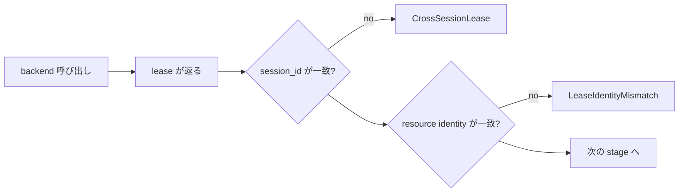

<!-- doc-type: concept -->

# lease の binding

[Session orchestrator](README.md) / lease の binding

> **対象読者:** backend adapter を実装する人、tenant 分離をレビューする人

backend が返す lease は、effect が commit された証拠として扱われる。[`lib.rs`](../../crates/session-orchestrator/src/lib.rs) は、その lease が本当にこの session の resource を指しているかを、次の stage に進む前に照合する。

## 何を防ぎたいのか

backend は trait 越しの他人のコードである。bug でも、compromise されていても、返す値は orchestrator が決められない。

```text
backend が別 session の BrokerLease を返す
  -> 新しい guest が、別 tenant の Broker connection 越しに egress する
  -> しかも cleanup がその connection を close する
```

同じことが VM でも workspace でも起きる。したがって、受け取った lease は全部照合する。



## 何と照合するか

全 lease が共通で `session_id` を見る。加えて、resource ごとに紐づく identity を見る。

| lease | 追加で照合する identity |
|---|---|
| `WorkspaceLease` | `workspace_id` |
| `BrokerLease` | `broker_session_id` |
| `VmLease` | `vm_id`、`workspace_id`、`broker_session_id` |
| `CapabilityLease` | `capability_id`、`subject_id` |
| `WorkloadLease` | `vm_id`、`subject_id`、`capability_id` |

VM の 3 点照合が効く場面は具体的である。別の workspace clone で起動した VM は、guest に別 session の source tree を渡す。別 session の Broker connection に繋がった VM は、別の capability で認可された channel へ egress request を流す。

workload の 3 点照合も同じ。root capability がこの orchestrator の発行したものでない subject の下で workload を解放すると、停止時の `revoke_root_capability` が別の capability を revoke する。動いている agent の authority は残る。

## 順序が型で決まっている部分

`start_vm` は `&BrokerLease` を、`release_workload` は `&CapabilityLease` を引数に取る。したがって、Broker を確立せずに VM を起動する、あるいは capability を注入せずに workload を解放する経路は、compile が通らない。

型で守られていない順序もある。workspace が Broker より前であることは規約で、cleanup の gate がそれに依存している。詳細は [session の commit 順序](lifecycle.md#commit-の順序)。

## 照合は次の stage へ進む条件

`validate_*` は `Option<StartFailure>` を返し、`Some` なら `start_session` がそこで止まる。warning を出して続けることはしない。

失敗は 2 種類に分かれる。

| 失敗 | 意味 |
|---|---|
| `CrossSessionLease { resource, expected, received }` | `session_id` が別 session のもの |
| `LeaseIdentityMismatch(resource)` | session は合っているが、resource identity が違う |

前者は backend が他 tenant の resource を返した状態で、tenant 分離の問題。後者は同じ session 内の取り違えで、backend 実装の bug。運用上の対処が違うので分けてある。

## 検出であって防止ではない

照合が保証するのは、orchestrator が誤った lease を**次の stage へ渡さない**ことだけ。

backend が正しい identity を持つ lease を作ることは強制できない。`session_id` を正しく埋めて、実際には別の VM を指す lease を返すことは、型の上では可能である。lease が「commit point に到達した後にだけ返る」という約束も、破っても検出できない。

契約としての詳細は [production backend 契約](contracts.md)。

## workspace は `active` の前に検証される

workspace の lease 検証だけは `ActiveSession` を作る前に走るので、通常の rollback 経路に乗らない。失敗したときは、その場で `isolate_workspace` を呼んで clone を解放する。解放にも失敗したら `rollback_failures` に載せて返す。

詳細は [session の commit 順序と cleanup](lifecycle.md#workspace-の-lease-検証失敗も-rollback-する)。

## 何が助かるのか

backend の bug が、その stage で止まる。誤った lease を持ったまま先へ進んで、後の stage で不整合として現れることがない。

失敗が `CrossSessionLease { resource, expected, received }` と `LeaseIdentityMismatch(resource)` に分かれているので、「別 session のものだった」と「同じ session だが別 resource だった」を区別できる。

## 正確な保証範囲

- 照合は lease が持つ identity 値の比較だけ。lease が指す実 resource が存在すること、その resource がその identity を持つことは確認していない。
- `WorkspaceLease` の `CrossSessionLease` 経路と、その clone 解放は test 済み。`LeaseIdentityMismatch` 側は未検証。
- backend が commit point 到達後にだけ lease を返すという約束は、型でも test でも確認していない。
- production adapter の composition test は外部 command/filesystem/API を fake に置き換えている。identity が adapter を貫通することは示すが、実機の起動は示さない。`scripts/ci/verify-real-session-owner.sh` の opt-in KVM gate は、実 `ProductionSessionRuntimeBuilder` / `SessionOwner`、guest readiness、`Continue` poll、stop/`Closed`、および subject/Broker/VM/cgroup/mapper/jail/socket/workspace の cleanup を確認する。ただし egress は closed のため、外部 provider、全ての CapFS effect、FUSE/OS semantics はこの gate の保証範囲に含まれない。
- production adapter の composition test は外部 command/filesystem/API を fake に置き換えている。identity が adapter を貫通することは示すが、実機の起動は示さない。`scripts/ci/verify-real-session-owner.sh` の opt-in KVM gate は、実 `ProductionSessionRuntimeBuilder` / `SessionOwner`、guest readiness、`Continue` poll、stop/`Closed`、および subject/Broker/VM/cgroup/mapper/jail/socket/workspace の cleanup を確認する。wrapper は jailer 実行に必要な実行可能 mount を事前検査する。ただし egress は closed のため、外部 provider、全ての CapFS effect、FUSE/OS semantics はこの gate の保証範囲に含まれない。

## 変更時の確認点

- lease に identity field を足すときは、対応する `validate_*` にも照合を足す。field だけ足しても compile は通り、照合されない値が増える。
- 照合を「一致しなければ warning」に変えない。次の stage へ進む条件であることが、この検査の意味。
- `validate_workspace` の失敗経路の rollback を消さない。`active` がまだ無いので、他の stage の rollback は届かない。
- backend の trait signature から `&BrokerLease` や `&CapabilityLease` を外さない。順序を型で守っている数少ない箇所。

## 関連

- [Session orchestrator](README.md)
- [session の commit 順序と cleanup](lifecycle.md)
- [identity と ledger](identity-ledger.md)
- [production backend 契約](contracts.md)
- [検証対応表](verification.md)
- [用語集](../glossary.md)
