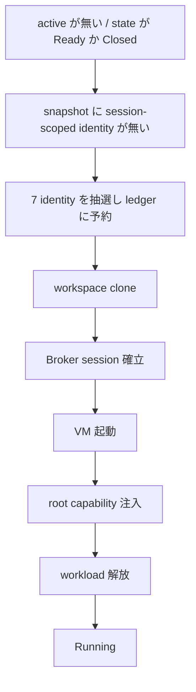

<!-- doc-type: concept -->

# session の commit 順序と cleanup

[Session orchestrator](README.md) / session の commit 順序と cleanup

> **対象読者:** session lifecycle を触る実装者、失敗時に host へ何が残るかを確認する人

[`lib.rs`](../../crates/session-orchestrator/src/lib.rs) は 1 つの microVM session を 5 段階で組み立て、失敗したら依存の逆順に解放する。cleanup 自体が失敗したら `Stopping` に留めて retry を待つ。

## 何を防ぎたいのか

session が半端に成立した状態で、orchestrator が次の session を受け付けると、host に持ち主のいない resource が残る。

一番悪い形は、`self.active` を上書きすることで起きる。

```text
1 つ目の session が Running
  -> 2 つ目の start_session が self.active を上書き
  -> 1 つ目の WorkspaceLease / VmLease / CapabilityLease が消える
  -> VM は動いたまま、root capability は有効なまま、誰も kill できない
```

lease は cleanup が持つ唯一の handle である。これを失うと、live な guest が有効な authority を持ったまま所有者不在になる。だから `start_session` は `self.active` が埋まっていれば拒否する。状態も `Ready` か `Closed` でなければ受け付けない。

## commit の順序



**ledger の予約が clone より前にある。** 逆にすると、`<clone_root>/<workspace_id>` という directory が、まだ commit していない `workspace_id` で作られる。crash 後に同じ ID が再び払い出されると、新しい session が古い tree に clone する、あるいは再利用することになる。

Broker が VM より前、capability が workload より前なのは trait の型が強制している。`start_vm` は `&BrokerLease` を、`release_workload` は `&CapabilityLease` を取る。入れ替えると compile が通らない。意味としても、Broker listener が無い VM には egress の相手がいないし、注入前に解放された workload は Authority Core の記録が無いまま無制限に動く。

**workspace が Broker より前なのは型で強制されていない。** cleanup 側が workspace の isolation を最後に行い、しかも `broker_closed` で gate しているので、取得順で workspace が最も外側にないと逆順解放が定義できない。ここは規約であって、compile では守られない。

## snapshot の検査

```rust
if let Some(inherited) = snapshot.inherited_ids().first() {
    return Err(... StartFailure::SnapshotContainsSessionIdentity { .. });
}
```

session-scoped identity を 1 つでも宣言している snapshot は、backend を呼ぶ前に拒否する。前の session の `subject_id` や `capability_id` を持ったまま boot すると、guest が Authority Core の既存 capability に紐づく identity を名乗ることになる。新しく発行した root capability ではなく、古い session の authority を継承してしまう。

**ただし、この crate は snapshot image を一度も見ていない。** `SnapshotDescriptor` は呼び出し側が渡す申告で、「この snapshot に session identity は入っていない」は caller の主張である。中身が汚れていて descriptor が綺麗な image は、素通りする。

## cleanup の順序

```text
1. revoke_root_capability
2. kill_vm
3. close_broker_session
4. isolate_workspace   ← vm_killed && broker_closed のときだけ
```

**revoke が最初なのは、kill が遅れたり失敗したりしたときの窓を縮めるため。** kill を先にすると、hung した `kill_vm` の間ずっと、生き残った agent が有効な root capability を持つ。

**isolation が最後で、しかも hard gate が付いている。** `kill_vm` が失敗した状態で clone を消すと、live な Firecracker VM の下から tree が消える。しかも host path が解放されるので、次の session に再割り当てされうる。古い VM がその path への descriptor を持ったままになる。決定の背景は [ADR 0014](../decisions/0014-keep-the-workspace-when-vm-kill-fails.md)。

kill と close の順序は終了状態には効かない。どちらも 1 pass で無条件に試みる。効くのは「live な VM が使える vsock channel をどれだけ長く持つか」だけ。

## `Stopping` に留まる

4 段階すべてが完了したときだけ `Closed` になり、`active` を捨てる。1 つでも残れば `StopError::Cleanup` を返し、session と lease を保持したまま `Stopping` に留まる。

startup rollback が失敗した場合も同じ。`finish_failed_start` は失敗が空なら `Ready` に戻して `active` を捨て、失敗があれば `Stopping` にして `active` を保持する。

保持しないと、解放できなかった resource の lease が消える。retry する手段が無くなり、orchestrator は漏れた resource の隣で新しい session を始めてしまう。

## workspace の lease 検証失敗も rollback する

lease 検証はどの stage でも次へ進む条件だが、workspace だけは `active` を作る前に起きる。

```text
clone_workspace が成功
  -> validate_workspace が失敗
  -> isolate_workspace で clone を解放
  -> 失敗したら rollback_failures に載せて StartError を返す
```

`active` がまだ無いので通常の rollback 経路には乗らない。ここで解放しないと、物理的な clone directory が lease も返らないまま host に残り、到達手段が消える。`foreign_workspace_lease_isolates_the_clone_before_returning` が、`workspace.clone` と `workspace.isolate` だけが呼ばれ、以降の backend に触れないことを固定している。

## 状態 enum の半分は観測できない

`LifecycleState` は 9 値を公開しているが、`state()` が返しうるのは 4 つだけ。

| 観測できる | 観測できない |
|---|---|
| `Ready` | `WorkspaceCloned` |
| `Running` | `BrokerEstablished` |
| `Stopping` | `VmStarted` |
| `Closed` | `RootCapabilityInjected` |
| | `WorkloadReleased` |

後者は `start_session` の中でだけ代入され、return する前に上書きされる。すべての失敗経路は `finish_failed_start` を通って `Ready` か `Stopping` になり、成功は `Running` で終わる。**これらの variant に match するコードは到達しない。**

## 何が助かるのか

失敗時に host へ何が残るかが `CleanupProgress` の 4 つの bool で分かる。ただし読み方に注意が要る（下記）。

`Stopping` が「未完了の resource がある」ことを 1 つの状態で表すので、orchestrator が次の session を受け付けないという判断が 1 箇所で決まる。

## 正確な保証範囲

- backend はすべて trait 越し。この file が行う I/O は ledger file と `/dev/urandom` だけ。
- 全resourceの`CrossSessionLease`と、workspace／Broker／VM／Capability／Workloadの`LeaseIdentityMismatch`をtestし、各committed stageの逆順rollbackと後段未到達を固定する。
- cleanup flagがpendingなのに対応lease／VM start attemptが無い内部不整合は、空の`StopError::Cleanup`にせず、該当するtyped `CleanupFailure`を必ず返してfail-stopするunit testがある。
- 同時に失敗した全attempted cleanup stageを順序付きで`rollback_failures`へ記録し、VM／Broker cleanupが失敗したときworkspace isolationをdependency-blockedとして呼ばないmatrix testがある。
- production compositionのfake境界に加え、required KVM gateが実Firecracker、dm-verity、seccomp、Broker per-port listener、全13 CapFS effect、SessionOwner cleanupを確認する。
- `SessionOrchestrator::new` は default type parameter で process-local ledger を選ぶ。production host が `new_durable` を忘れても compile は通り、contract test も全部通る。

## 変更時の確認点

- lease を保存する行と、その cleanup flag を落とす行は 2 つの独立した文になっている。`active.broker = Some(...)` と `broker_closed = false` のように対で書く。**flag 側を書き忘れても compile は通り、cleanup がその stage を丸ごと飛ばす。** `stop_session` は成功を返すのに VM が動き続ける。
- `CleanupProgress` の field 名は完了を意味するように読めるが、初期化は不在を意味する。`capability_revoked: capability.is_none()` なので、`true` は「revoke に成功した」ではなく「revoke するものが無かった」。監査記録として読まない。
- stage を足すときは、取得順の位置と cleanup の gate を同時に決める。workspace が最も外側という規約は型で守られていない。
- `LifecycleState` の中間 variant を返すようにするなら、`state()` の経路を変える必要がある。現状は代入されるだけで観測できない。

## 関連

- [Session orchestrator](README.md)
- [identity と ledger](identity-ledger.md)
- [lease の binding](lease-binding.md)
- [production backend 契約](contracts.md)
- [検証対応表](verification.md)
- [0014](../decisions/0014-keep-the-workspace-when-vm-kill-fails.md)
- [用語集](../glossary.md)
