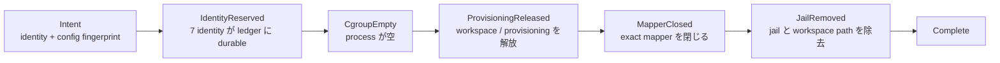

<!-- doc-type: contract -->

# session recovery journal

[Session orchestrator](README.md) / session recovery journal

> **対象読者:** Firecracker runtime、durable path、crash recovery の実装者と運用担当者

production `SessionOwner` は、startup effect の前に一つの exact session identity と runtime
configuration fingerprint を `DurableSessionRecoveryJournal` に publish する。process が途中で
停止しても、次回 build はその intent と最新 checkpoint から同じ resource を照合して cleanup を
再開する。これは controller の admission journal ではなく、worker 内の resource ownership journal
である。

## 対象ソース

- [`recovery.rs`](../../crates/session-orchestrator/src/recovery.rs): recovery intent、stage、durable format、lock、path validation
- [`production_runtime.rs`](../../crates/session-orchestrator/src/production_runtime.rs): ledger exactness、crash 後の drain、Firecracker resource cleanup
- [`lib.rs`](../../crates/session-orchestrator/src/lib.rs): session identity ledger と orchestrator の startup/stop lease

## 三つの durable file を分ける

| file / abstraction | 所有する事実 | 完了条件 |
|---|---|---|
| `DurableIdentityLedger` | 7 identity の no-reuse（Session、Request、VM、Subject、Workspace、Capability、BrokerSession） | batch append、record sync、header sync |
| `DurableSessionRecoveryJournal` | 一つの session の config fingerprint と cleanup stage | `Complete` checkpoint |
| `ControlJournal` | controller の request、quota、worker ownership | `Closed` checkpoint |

identity ledger の record を消して recovery journal を `Complete` にすること、または controller
journal を閉じて worker resource を手動で削除することは、いずれも正しい recovery ではない。

## publish と stage

recovery intent は session identity と 32 byte の config fingerprint を持つ。journal は owner-only
file と stable lock を検証し、parent、inode、length、owner、mode、link count の drift を fail
closed にする。record は固定 192 byte、header は二つの 32 byte slot、最大 record 数は 65,536 で
ある。CRC/checksum は破損検出であり、file を書ける者からの意図的な改竄を防ぐ MAC ではない。

effect と checkpoint の順序は次の通りである。

`Intent` は effect より前に存在する。`IdentityReserved` に進むには ledger に同じ七つの identity
が durable に存在し、startup request の config fingerprint と recovery intent が一致しなければ
ならない。identity が未予約の `Intent` は、resource cleanup を推測して進めず、production build
を fail closed にする。ただし、identity reservation より前に中断した intent だけは
`Abandoned` として閉じられる。

cleanup は checkpoint の次の stage だけを実行し、checkpoint を effect 完了後に sync する。
再起動時に既存の checkpoint 以上の effect を繰り返し、各 adapter が exact identity、config
fingerprint、device UUID/devno/root hash、mount/cgroup ownership を検証する。`JailRemoved` 後は
`Complete` を記録し、pending intent を残さない。

## build と stop の境界

production runtime の build は、recovery journal と identity ledger を同時に開いて exactness を
検証する。pending intent があれば cleanup を `Complete` まで drain し、未完了なら owner を返さず
build を失敗させる。通常 startup は intent を prepare し、identity batch の commit 後に
`IdentityReserved` を checkpoint してから workspace、Broker、VM、Authority、workload の effect
へ進む。

通常 stop と startup rollback が VM kill、workspace isolation、mapper、jail などの adapter effect
を完了するときも、同じ journal の stage を進める。resource の一部だけを片付けた状態で
`Complete` を先に書かない。`SessionOrchestrator` の `Stopping` は trait lease の cleanup を
保持する境界であり、production runtime の recovery journal は process crash をまたぐ境界で
ある。

## path と運用

- journal、ledger、Broker WAL、stop/status root、jail は `host-sessiond@<ID>` の instance-scoped
  root から構成する。`deploy/host-sessiond-worker.env.example` にない共有 path を追加しない。
- journal と lock の parent は effective owner が管理し、group/other writable、symlink、hardlink、
  non-regular file を許可しない。open 後に path/inode/length が変わった場合、以前の path が戻って
  も同じ handle は poison されたままである。
- cgroup は `cgroup.procs` が空になるまで待ち、mapper は exact device と identity を照合して
  から閉じる。workspace/jail を先に消して live VM の descriptor を残してはならない。
- recovery は `host-sessiond-recover@.service` から起動する。controller、unit、journal、WAL、
  mapper、cgroup を手動削除して recovery 記録を整合させようとしてはならない。
- root が path を差し替え、key・journal を意図的に再符号化し、または Firecracker/kernel TCB を
  侵害した場合の安全性はこの journal だけでは保証しない。

## 検証

| 対象 | 検証 |
|---|---|
| stage 遷移、単調性、古い lease、`Abandoned` の境界 | `recovery.rs` の journal unit tests |
| intent、ledger 7 identity、fingerprint の exactness | `production_runtime` の recovery/ledger tests |
| crash point からの全 stage drain と再open | `build_drains_every_durable_recovery_crash_point_to_completion`、`incomplete_provisioning_recovery_fails_the_build_closed` |
| 実 KVM、cgroup、mapper、jail、workspace の cleanup | `scripts/ci/verify-real-session-crash-recovery.sh`、`scripts/ci/verify-real-session-owner.sh` |
| worker kill、controller restart 後の systemd recovery | `scripts/ci/verify-real-systemd-control-plane.sh` |

mock と deterministic fault test は stage の順序、checksum、lock、path drift を検証するが、任意の
kernel interleaving、VM escape、host root の悪意ある操作を証明しない。実機 gate も列挙した resource
と checkpoint だけを対象にする。

## 保証範囲外

recovery journal の checksum は MAC ではなく、journal file を変更できる host root や所有者の
悪意ある書換えを防がない。journal は分散 host 間の lock、Firecracker/kernel の TCB、任意の
外部 device、全ての kernel scheduling を保証しない。実機 gate を通過しても、列挙した cgroup、
provisioning、mapper、jail、workspace とその checkpoint 以外の resource が自動的に発見・回収
されるわけではない。

## 関連

- [multi-session control plane](control-plane.md)
- [systemd worker 境界](systemd-worker.md)
- [session の commit 順序と cleanup](lifecycle.md)
- [identity と ledger](identity-ledger.md)
- [production backend 契約](contracts.md)
- [検証対応表](verification.md)
