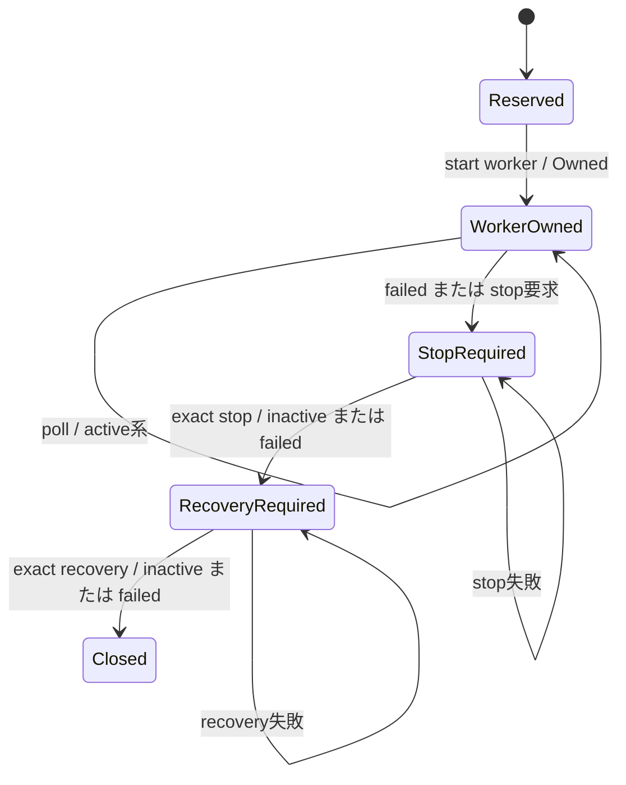

<!-- doc-type: contract -->

# systemd worker 境界

[Session orchestrator](README.md) / systemd worker 境界

> **対象読者:** unit template、polkit、`PinnedSystemdManager` の実装者と運用担当者

multi-session controller は systemd に任意の command、unit、argument、property を渡さない。
durable に確保した `ControlSessionId` を lower-case hex で埋め込んだ二つの template 名だけを
生成し、digest-pinned `systemctl` に固定引数で渡す。

## 対象ソース

- [`systemd_worker.rs`](../../crates/session-orchestrator/src/systemd_worker.rs): fixed manager、unit state、worker factory、stop/recovery
- [`control_plane.rs`](../../crates/session-orchestrator/src/control_plane.rs): worker ownership と `Reserved -> Active -> Closed` journal transition
- [`host-controld.rs`](../../crates/session-orchestrator/src/bin/host-controld.rs): controller の systemd manager 結線と bounded daemon loop

## 固定された unit 名

```text
host-sessiond@<32 lowercase hex>.service
host-sessiond-recover@<32 lowercase hex>.service
```

`<32 lowercase hex>` は non-zero の 128-bit session ID で、session ID の文字列以外を unit 名に
連結できない。`systemctl` の invocation は `--no-ask-password --no-pager` と固定 operation、
固定 unit の組み合わせである。controller の CLI から program、path、environment、guest
credential、systemd property を注入する経路はない。

polkit rule は `host-controld` に対し、32 桁 lower-case hex の worker instance の start/stop と、
対応する recovery instance の start だけを許す。任意 unit、任意 verb、任意の template suffix は
この rule の対象外である。

## state と cleanup

`PinnedSystemdManager` は `LoadState=loaded` と `ActiveState` の組を完全一致で読む。

| systemd の観測値 | adapter の扱い |
|---|---|
| `loaded` + `active/activating/deactivating/reloading` | `Owned`。worker の所有は継続 |
| `loaded` + `inactive` | `Inactive`。worker process が無いことを示す |
| `loaded` + `failed` | `Failed`。clean close ではない |
| それ以外、malformed、command failure | `StatusUnavailable`。fail closed |

通常の stop は exact worker に `stop` を送り、`inactive` または `failed` を確認してから、
recovery template を start する。recovery が `inactive` または `failed` で終了した場合だけ、
その session の cleanup を成功とみなせる。`failed` は systemd の tombstone として残り得るが、
poll では `Closed` に変換しない。まず exact stop と recovery の組を通す必要がある。



controller の journal では、worker 起動前が `Reserved`、起動成功後が `Active`、上記の exact
stop と recovery が完了した後だけ `Closed` である。worker の process exit や `failed` state の
観測だけで `Closed` を記録してはならない。

## unit の所有範囲

`service/host-sessiond@.service` は `Type=notify` で、一つの session instance に対応する。
`host-sessiond --systemd-instance %i --mode run` は instance ID から state、runtime、jail、ledger、
recovery journal、authority audit、Broker WAL の scoped path を構成し、systemd readiness は
runtime が実際に ready になった後に通知する。worker は `Restart=no` で、失敗した状態を controller
に隠さない。

worker は `host-sessiond` account と `kvm` supplementary group で実行し、unit が明示した KVM、
vsock、loop、device-mapper だけを device policy に入れる。cgroup delegation は worker の
`Delegate=yes` / `DelegateSubgroup=daemon` に閉じる。`host-controld` はこの capability envelope
を持たず、systemd/polkit の operation boundary のみを持つ。

`host-sessiond-recover@.service` は `Type=oneshot` で、通常 worker と conflict する。`--mode
recover` は session を新しく start せず、同じ instance-scoped path と recovery journal から
cleanup/reconciliation を完了させる。通常 worker と recovery worker を同時に動かす構成は
契約外である。

## 配置と変更手順

unit、polkit、environment、udev rule、三つの binary は同じ reviewed commit と externally
authenticated digest manifest から install する。`deploy/host-sessiond-worker.env.example` の
root/BASE 変数は instance ID の path separation を保つための入力であり、legacy の
`host-sessiond.env.example` と混ぜない。変更後は最低限次を実行する。

```bash
systemd-analyze verify /etc/systemd/system/host-controld.service \
  /etc/systemd/system/host-sessiond@.service \
  /etc/systemd/system/host-sessiond-recover@.service
scripts/ci/check-service-boundaries.sh
scripts/ci/verify-real-systemd-control-plane.sh
```

`systemctl daemon-reload` と service restart は deployment operator が reviewed artifact を検証
した後に行う。worker の failed state、残留 cgroup、mapper、jail、WAL があるときに unit file を
差し替えて先へ進めたり、instance file を手動削除したりしない。controller restart が exact
recovery を実行できない場合は新規 admission が止まる。

## 正確な保証範囲

この adapter が閉じるのは、controller から systemd へ渡る operation と unit name、state の
解釈、failed worker の cleanup 順序である。unit test は exact session、canonical template、
failed state、stop + recovery の順序を検査する。

## 保証範囲外

systemd、polkit、digest-pinned `systemctl` binary、Firecracker、kernel、device-mapper、cgroup
の正しさ全体を Rust unit test だけで証明するものではない。device-mapper と loop device の
class-wide access は `veritysetup` の動的 minor のために必要で、worker/Firecracker TCB が
侵害された後の worker 間 containment は保証しない。実機 gate を通過しても、任意の unit や
任意の systemd verb が安全になるわけではない。
device-mapper と loop device の class-wide access は `veritysetup` の動的 minor のために必要で、
worker/Firecracker TCB が侵害された後の worker 間 containment は保証しない。

## 検証

| 対象 | 検証 |
|---|---|
| exact template、session ID の lower-case hex、start/poll/stop/recovery の引数 | `factory_uses_only_the_exact_session_for_start_poll_stop_and_recovery`、`template_names_are_closed_and_canonical` |
| `failed` を clean inactive と誤認しない | `failed_systemd_state_is_never_reported_as_cleanly_inactive` |
| failed worker の exact stop + recovery | `failed_worker_poll_requires_the_exact_stop_and_recovery_path` |
| 実 unit、polkit、peer UID、worker process、kill 後 recovery | `scripts/ci/verify-real-systemd-control-plane.sh` |

## 関連

- [multi-session control plane](control-plane.md)
- [session recovery journal](recovery.md)
- [production backend 契約](contracts.md)
- [deployment boundary](../../deploy/README.md)
- [検証対応表](verification.md)
