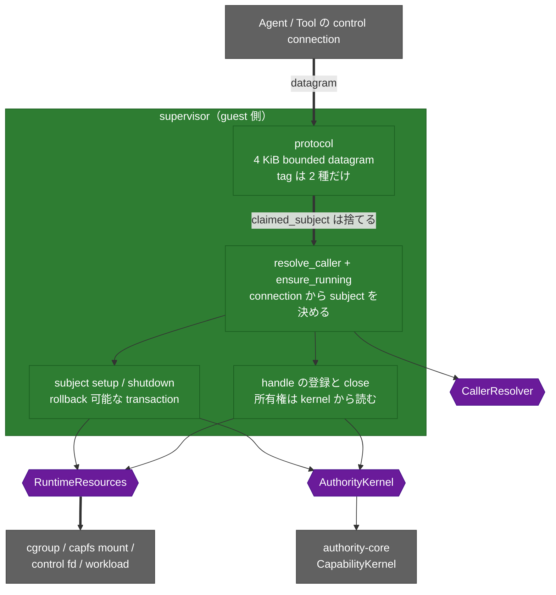

<!-- doc-type: index -->

# Supervisor adapter

[ドキュメント一覧](../README.md) / Supervisor adapter

> **対象読者:** guest supervisor の統合担当者、Authority Core 実装者、runtime adapter のレビュー担当者

`supervisor` は、認証済みの local connection、既存の `authority-core` kernel、OS の runtime resource の 3 つの間に置く lifecycle adapter である。

**syscall を 1 つも呼ばない。** namespace、cgroup、mount、descriptor の操作はすべて `RuntimeResources` trait に委ね、権限判定はすべて `AuthorityKernel` trait に委ねる。この crate が持つのは、どの subject として動くかを決めることと、resource を確保・解放する順序だけ。

## crate の構造

syscall は 1 つも呼ばない。namespace も cgroup も mount も `RuntimeResources` に委ね、権限判定は `AuthorityKernel` に委ねる。この crate が決めるのは「誰の要求か」と「どの順で確保・解放するか」だけ。

## この crate が決めること

| 決めること | どこで |
|---|---|
| 要求が誰のものか。wire 上の申告は使わない | [誰の要求として扱うか](caller-identity.md) |
| 何を受け付けるか。4 KiB の bounded envelope、tag 2 種 | [wire protocol](wire-protocol.md) |
| resource をどの順で確保し、どの順で解放するか | [subject の setup と shutdown](subject-lifecycle.md) |
| descriptor と authority の記録をどう同期させるか | [handle の lifecycle](handle-lifecycle.md) |

## 文書一覧

| 文書 | 対象ソース | 内容 |
|---|---|---|
| [誰の要求として扱うか](caller-identity.md) | [`supervisor.rs`](../../crates/supervisor/src/supervisor.rs), [`control_socket.rs`](../../crates/supervisor/src/control_socket.rs) | connection からの subject 解決、3 段の照合、production の listener と peer credential、wire に無い操作 |
| [wire protocol](wire-protocol.md) | [`protocol.rs`](../../crates/supervisor/src/protocol.rs) | datagram の形、閉じた tag 集合、decode の検査順序 |
| [subject の setup と shutdown](subject-lifecycle.md) | [`supervisor.rs`](../../crates/supervisor/src/supervisor.rs) | setup transaction、rollback、authority を先に落とす順序 |
| [handle の lifecycle](handle-lifecycle.md) | [`supervisor.rs`](../../crates/supervisor/src/supervisor.rs) | 所有権検査の位置、2 つの集合、2 つの永久予約表 |
| [検証対応表](verification.md) | — | contract test で見た範囲と、残る未検証境界 |

## 実装範囲と検証境界

lifecycle、順序、rollback、handle の所有権は `CapabilityKernel`（本物）と `FakeResources`（event log）を使う contract test で検証済み。`CleanupStep::BeginClose` / `FinishClose` の fault-injection retry も unit test で固定している。

production の caller resolver と control socket は [`control_socket.rs`](../../crates/supervisor/src/control_socket.rs) にある。subject ごとの `SOCK_SEQPACKET` listener が `SO_PEERCRED` から `ConnectionIdentity` を組み立て、request bytes を読む前に subject を確定させる。共有 resolver の socket ID は listener をまたいで単調に進み、close 後も再利用しない。backlog `1..=128`、既定 receive/send timeout 30 秒（上限 300 秒）、同時 binding 4096 件、request 4 KiB、response 64 byte の bounded policy も transport で検査する。実 socket を使った module test で検証済みである。

cgroup、control socket、workload の実 Linux 実装は [`linux_host.rs`](../../crates/supervisor/src/linux_host.rs) の `LinuxHostResources` にある。subject ごとに cgroup v2 leaf を作り、`SOCK_SEQPACKET` の control socket を bind し、workload をその leaf に閉じ込めて起動し、停止時は `cgroup.kill` で subtree ごと落として reap する。capfs の実 mount と unmount は `CapfsRuntimeResources` が持つ。

handleにはOS objectを持たせていない。subjectのfileはcapfs mount越しに触るのでdescriptorはguest側にあり、hostが知る必要があるのは「どのhandle identityをまだ保持しているか」だけである。listenerをsubject setupへ結線するguest image compositionと、VM内の隔離workloadから全13 CapFS effect／Broker channelまでをKVM gateで確認済みである。

主要な認可拒否経路と wire spoof、control socket cleanup retry は test 済みである。root と disposable mount namespace が使える環境では、`scripts/ci/verify-real-supervisor-resources.sh` が `resources_mut()` 経由で production `LinuxHostResources` / `CapfsRuntimeResources` を実 FUSE、cgroup、seqpacket credential と通して検証する。この gate は `Supervisor` の subject lifecycle 全体や successful workload start の証明ではない。register→start の authority mutation は production kernel の snapshot で fail closed するが、任意の外部 interleaving の直列化や実 guest VM の接続など残る境界は[検証対応表](verification.md)に記載する。

## 特に注意する点

- `revoke` は caller と lifecycle を supervisor が検査し、対象 capability の holder であることを authority kernel が検査する。wire tag を足すときは両方の gate を維持する。
- `issue_root` は grant の対象 subject を確認するが、`derive` は確認しない。この非対称は意図された契約である。
- `resources_mut()` は無制限の `&mut R` を返し、この crate の gate を全部迂回する。production の `guest-supervisor-init` は bootstrap listener の予約という setup 前の明示的な host 操作に限って使い、通常の lifecycle mutation は `Supervisor` の gate 経由で行う。fault injection と privileged adapter test でも使う。
- `Supervisor::new` は subjects 1024 件、issued handles 65536 件の安全な session 永久上限を使う。`Supervisor::new_with_limits` / `CapfsRuntimeManager::into_supervisor_with_limits` で正の運用値を選べるが、閉じた identity は eviction されない。
- `DispatchResponse` は `WireResponse` に変換され、bounded encoder/decoder と実 socket の datagram 送受信で検証される。

## 関連

- [Authority Core の subject lifecycle](../authority-core/subject-lifecycle-and-handles.md)
- [Session orchestrator](../session-orchestrator/README.md)
- [runtime-isolation](../runtime-isolation/README.md)
- [隔離基盤の設計](../design/runtime-isolation.md)
- [決定記録](../decisions/README.md)
- [用語集](../glossary.md)
