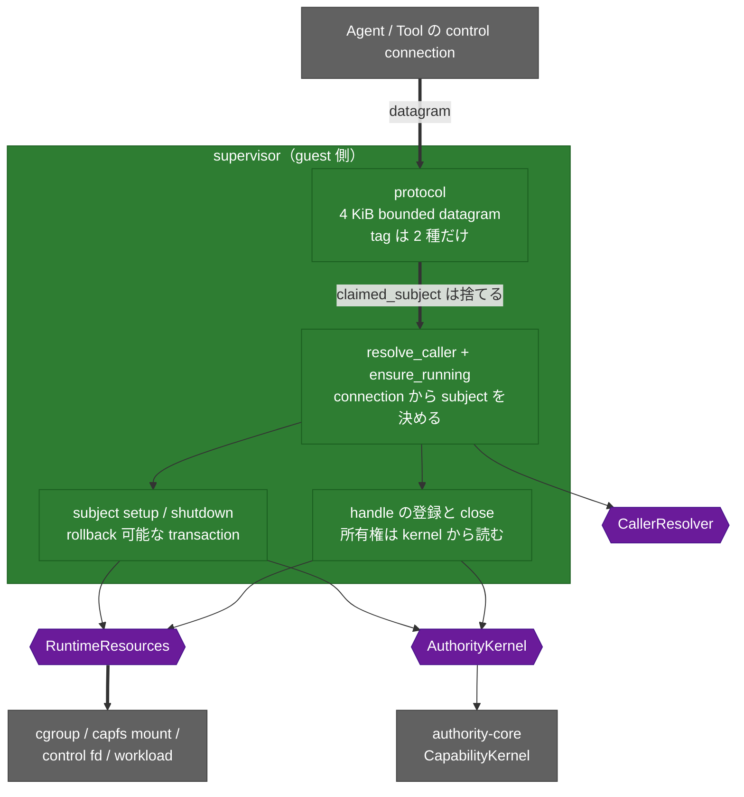

<!-- doc-type: index -->

# Supervisor adapter

[ドキュメント一覧](../README.md) / Supervisor adapter

> **対象読者:** guest supervisor の統合担当者、Authority Core 実装者、runtime adapter のレビュー担当者

`supervisor` は、認証済みの local connection、既存の `authority-core` kernel、OS の runtime resource の 3 つの間に置く lifecycle adapter である。

**syscall を 1 つも呼ばない。** namespace、cgroup、mount、descriptor の操作はすべて `RuntimeResources` trait に委ね、権限判定はすべて `AuthorityKernel` trait に委ねる。この crate が持つのは、どの subject として動くかを決めることと、resource を確保・解放する順序だけ。

## crate の構造

syscall は 1 つも呼ばない。namespace も cgroup も mount も `RuntimeResources` に委ね、権限判定は `AuthorityKernel` に委ねる。この crate が決めるのは「誰の要求か」と「どの順で確保・解放するか」だけ。

## この crate が決めること

| 決めること | どこで |
|---|---|
| 要求が誰のものか。wire 上の申告は使わない | [誰の要求として扱うか](caller-identity.md) |
| 何を受け付けるか。4 KiB の bounded envelope、tag 2 種 | [wire protocol](wire-protocol.md) |
| resource をどの順で確保し、どの順で解放するか | [subject の setup と shutdown](subject-lifecycle.md) |
| descriptor と authority の記録をどう同期させるか | [handle の lifecycle](handle-lifecycle.md) |

## 文書一覧

| 文書 | 対象ソース | 内容 |
|---|---|---|
| [誰の要求として扱うか](caller-identity.md) | [`supervisor.rs`](../../crates/supervisor/src/supervisor.rs) | connection からの subject 解決、3 段の照合、wire に無い操作 |
| [wire protocol](wire-protocol.md) | [`protocol.rs`](../../crates/supervisor/src/protocol.rs) | datagram の形、閉じた tag 集合、decode の検査順序 |
| [subject の setup と shutdown](subject-lifecycle.md) | [`supervisor.rs`](../../crates/supervisor/src/supervisor.rs) | setup transaction、rollback、authority を先に落とす順序 |
| [handle の lifecycle](handle-lifecycle.md) | [`supervisor.rs`](../../crates/supervisor/src/supervisor.rs) | 所有権検査の位置、2 つの集合、2 つの永久予約表 |
| [検証対応表](verification.md) | — | contract test で見た範囲と、検査があるのに test が無い箇所 |

## 実装範囲と検証境界

lifecycle、順序、rollback、handle の所有権はすべて `CapabilityKernel`（本物）と `FakeResources`（event log）を使う contract test で検証済み。

一方、Linux の namespace / cgroup / mount 実装、実 socket listener、実 workload、実 guest control channel はこの crate に存在しない。production の caller resolver も未実装で、`StaticCallerResolver` は in-memory の map である。

検査があるのに test が無い箇所がいくつかある。`ConnectionNotBoundToSubject`、`GrantSubjectMismatch`、`DuplicateSubject`、親の非 Running gate、`derive` の拒否経路。詳細は[検証対応表](verification.md)。

## 特に注意する点

- `revoke` は caller と lifecycle を検査するが、その caller が対象 capability を保持していることまでは検査しない。wire tag を足すときは所有権検査を先に足す。
- `issue_root` は grant の対象 subject を確認するが、`derive` は確認しない。この非対称は意図された契約である。
- `resources_mut()` は無制限の `&mut R` を返し、この crate の gate を全部迂回する。test での failure 注入用で、production から呼ばない。
- `DispatchResponse` に wire encoder が無い。返信の形式はまだ決まっていない。

## 関連

- [Authority Core の subject lifecycle](../authority-core/subject-lifecycle-and-handles.md)
- [Session orchestrator](../session-orchestrator/README.md)
- [runtime-isolation](../runtime-isolation/README.md)
- [隔離基盤の設計](../design/runtime-isolation.md)
- [決定記録](../decisions/README.md)
- [用語集](../glossary.md)
