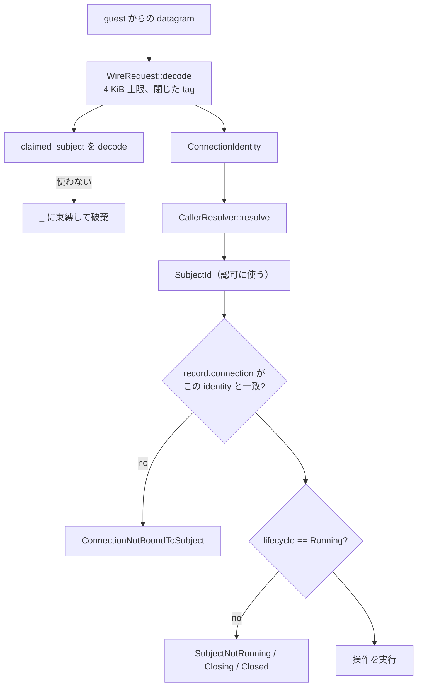

<!-- doc-type: concept -->

# 誰の要求として扱うか

[Supervisor adapter](README.md) / 誰の要求として扱うか

> **対象読者:** supervisor を触る実装者、認可の入口をレビューする人

[`supervisor.rs`](../../crates/supervisor/src/supervisor.rs) が最初に決めるのは「この bytes は誰からの要求か」である。答えは受理済み connection から取る。request の中身は見ない。

## 何を防ぎたいのか

wire の `WireRequest` は subject を表す field を持つ。guest が組み立てる bytes の一部なので、値は guest が決められる。

```text
guest が送れる CloseSubject:
  claimed_subject = "attacker-selected-subject"
```

これを認可に使えば、guest は任意の subject を閉じられる。閉じられた subject は workload を止められ、capfs を unmount される。**信用しない側が書いた 1 field が、cross-subject の shutdown primitive になる。**

だから `dispatch_wire` は claim を束縛しない。

```rust
WireRequest::CloseSubject { claimed_subject: _ } => { ... }
WireRequest::CloseHandle { claimed_subject: _, handle } => { ... }
```

`_` で捨てている。値は decode されるが、以降のどの経路にも渡らない。



決定の背景は [ADR 0013](../decisions/0013-resolve-caller-identity-from-the-connection.md)。

## 3 段の照合

connection から subject を引くだけでは足りない。3 つの検査が重なっている。

**1. resolver の binding。** `CallerResolver::resolve(&identity)` が `SubjectId` を返す。`StaticCallerResolver::bind` は 1 つの `ConnectionIdentity` を 1 つの subject にしか bind できない。既に埋まっていれば `Err` を返す。host 側の設定ミスで、稼働中の channel の権限が黙って変わることを防ぐ。

**2. record との一致。** `resolve_caller` は、解決した subject の record が持つ `connection` が、今の identity と一致することを確認する。

```rust
if self.subjects.get(&caller).is_some_and(|record| record.connection != *identity) {
    return Err(SupervisorError::ConnectionNotBoundToSubject { .. });
}
```

resolver が 2 つ目の connection を同じ subject に bind した場合、この検査で落ちる。subject を作ったときの connection でしか、その subject を操作できない。

**3. lifecycle。** `ensure_running` が `Creating` / `Closing` / `Closed` を拒否する。`Closing` の subject は既に capability を revoke されているので、新しい handle を登録させると `finish_subject_close` が永久に失敗する。

`is_some_and` に注意点がある。supervisor が追跡していない subject は検査 2 を通過する。その場合の拒否は `ensure_running` の `UnknownSubject` が担う。**caller を解決してから `ensure_running` を呼ばない経路を新しく書くと、resolver は知っているが supervisor は追跡していない subject からの要求を受け付ける。**

## `create_subject` でも binding を確認する

subject を作るとき、渡された `connection` が resolver 上で本当にその `subject_id` に bind されているかを確認する。

```rust
let bound_subject = self.callers.resolve(&connection)?;
if bound_subject != subject_id {
    return Err(SupervisorError::ConnectionSubjectMismatch { requested: subject_id, bound: bound_subject });
}
```

これが無いと、record の `connection` field が別の subject に解決される channel を指すことになる。検査 2 の等号比較が「間違った対応」を検証してしまい、その channel からの要求が record の subject として動く。

## production の resolver と listener

[`control_socket.rs`](../../crates/supervisor/src/control_socket.rs) が production 側の 2 つを提供する。Linux でのみ compile される。

**`SubjectControlListener` は subject ごとに 1 本の `SOCK_SEQPACKET` socket を持つ。** その socket で受理した connection は、構造上その subject のものにしかならない。ADR 0013 の「1 connection = 1 subject」を、後から書き足す検査ではなく transport の性質として持たせている。

```rust
let mut listener = SubjectControlListener::bind(path, subject, credential, backlog)?;
let connection = listener.accept(&mut resolver)?;   // ここで binding が確定する
let identity = connection.identity();               // peer credential は kernel から取る
let request = connection.receive_request()?;        // bytes を読むのはこの後だけ
```

`accept` は `SO_PEERCRED` を読んで `ConnectionIdentity` を組み立て、`SubjectCredentialResolver` に binding を登録してから返す。**request bytes へ到達する唯一の経路が `AcceptedControlConnection::receive_request` なので、decode より前に subject が決まっていることが型で保証される。** ADR 0013 が要求する順序が、規律ではなく API の形になっている。

`SOCK_SEQPACKET` を使うのは、1 request = 1 datagram を kernel に守らせるためである。byte stream だと peer が request を分割・連結でき、境界の解釈が supervisor 側の実装になる。

**`SubjectCredentialResolver` は socket ID から subject を引き、peer credential が一致することを要求する。** subject を provisioning したときの uid/gid と、kernel が報告した uid/gid が違えば `ForeignCredential` で落ちる。未登録の socket ID は `Unbound` で落ちる。`bind` は同じ socket ID の再登録を `ConnectionRebindError` で拒否する。

socket は bind 直後に mode 0600 へ絞る。node が出来るのは bind の後なので、connect され得る前に権限が閉じている。

listener は lexical absolute path と安全な parent だけを受け付ける。backlog は `1..=128`、
accepted connection の receive/send timeout は既定 30 秒で、それぞれ 300 秒を上限とする。同時に
live な resolver binding は 4096 件までで、超過した accept は新しい caller identity を作らずに
拒否する。request は 4 KiB を超える datagram を decode 前に捨て、response は 64 byte 以下の
一つの `SOCK_SEQPACKET` datagram として bounded send timeout 内に送る。これらは認可判定ではなく、
peer が resource を保持したまま待ち続ける時間とメモリ／connection 数を閉じる transport policy
である。

## `ConnectionIdentity` の強さ

`ConnectionIdentity` は 4 field を持ち、比較と hash はその全部を使う。identity の強度は host の socket ID 割り当てと peer credential の質で決まる。

**production の `SubjectCredentialResolver` は accepted connection ごとに process-local な単調カウンタから socket ID を払い出し、`release` 後も同じ値を再利用しない。** 同じ resolver を複数の `SubjectControlListener` で共有すれば listener をまたいでも連番は一つであり、上限到達、counter exhaustion、重複 bind は fail closed になる。これは restart をまたぐ durable identity ではなく、resolver instance の寿命の範囲だけの性質である。`StaticCallerResolver` は caller が渡す in-memory map なので、この production allocation contract を持たない。

`WireRequest` の bytes から `ConnectionIdentity` を組み立ててはならない、という制約は doc comment にしか書かれていない。型としては構築を止めていない。

## 認可経路に無い操作

`Supervisor` の public method のうち、wire から到達できないものがある。

| method | wire tag | caller 検査 |
|---|---|---|
| `dispatch_wire` → `CloseSubject` | 1 | あり |
| `dispatch_wire` → `CloseHandle` | 2 | あり |
| `issue_root` | 無し | `ensure_running` のみ |
| `derive` | 無し | `ensure_running` のみ |
| `open_handle` | 無し | `ensure_running` のみ |
| `revoke` | 無し | `resolve_caller` + `ensure_running` |

`revoke` も他の authority 操作と同じく `ConnectionIdentity` を取り、`resolve_caller` と `ensure_running` を通る。以前は identity を取らず lifecycle も見ていなかったため、`&Supervisor` を持つコードなら session 内の任意の `CapId` を revoke できた。guest から到達できないのは `WireRequest` に revoke tag が無いからにすぎず、`protocol.rs` に 3 つ目の tag を足して `dispatch_wire` に match arm を書けば compile が通る状態だった。

**tag を足すときは、その操作が caller 検査を通ることを確認する。** 現在は `revoke` を wire に出しても、caller 自身の connection と Running 状態が要求され、authority kernel が capability の holder であることも検査する。

`derive` にも非対称がある。`issue_root` は `grant.subject()` が引数の subject と一致することを確認するが、`derive` は確認しない。親を持つ caller は、その grant が対象 subject の静的 envelope に収まる限り、別 subject が保持する capability を発行できる。Authority Core の derive は対象が caller の子孫であることを要求しないので、この非対称が実際の契約になっている。

## 何が助かるのか

認可に使う値の出所が 1 つに絞られている。「この要求は誰のものか」を調べるとき、`ConnectionIdentity` からの経路だけを追えばよい。

`claimed_subject` を `_` で捨てているので、後から誤って使う変更は目に付く。field を読む行を書けば、レビューで見える。

## 正確な保証範囲

- `StaticCallerResolver` は in-memory の map で、実 socket の peer credential を読まない。test と小さな host adapter 用である。
- `SubjectControlListener` は実 `SOCK_SEQPACKET` socket に対して module test で検証済み。実 `SO_PEERCRED` の取得、resolver を共有した listener 間での socket ID の単調割り当てと非再利用、4 KiB 超 datagram の decode 前拒否、mode 0600、絶対 path 以外の拒否、backlog/timeout/binding 上限を確認している。
- guest VM内の`guest-supervisor-init`からproduction listener／Supervisor／isolation launcher／workloadへ至るcompositionはKVM gateで確認済み。uid/gidを偽装したpeerの負試験は別uid processを使うhost module testの範囲に限られる。
- `SubjectControlListener`を`Supervisor::create_subject`へ接続する組み立ては`guest-supervisor-init`にあり、実guest imageで起動確認する。
- `ConnectionNotBoundToSubject`、`CallerBindingError`、`GrantSubjectMismatch`、`DuplicateSubject`、親の非 Running gate、`derive` の非 holder 拒否は supervisor level の test で確認している。
- `revoke` の caller/lifecycle gate は supervisor が行い、対象 capability の holder 検査は authority kernel が行う。非 holder の拒否を `root_derive_and_revoke_use_typed_authority_kernel_transitions` で確認している。
- `CloseHandle` の foreign subject 拒否と `CloseSubject` の claim 無視は wire 経路で確認している。前者は runtime adapter に到達しないこと、後者は caller 自身だけが閉じることまで assert する。
- `derive` の非対称が実際に悪用可能かは検証していない。

## 変更時の確認点

- `claimed_subject` を `_` 以外に束縛しない。認可に使う値が 2 系統になる。
- `protocol.rs` に tag を足すときは、`dispatch_wire` の match arm と caller 検査を同じ変更で書く。`revoke` を wire に出す場合は、caller と lifecycle の検査だけでは足りない。capability の所有権検査を先に足す。
- caller を解決する新しい経路を書くときは、必ず `ensure_running` を通す。`resolve_caller` の `is_some_and` は、追跡していない subject を通す。
- `derive` に `grant.subject()` の検査を足す場合、[Capability state](../authority-core/capability-state.md) の derive 契約と矛盾しないかを先に確認する。現在の非対称は意図された契約である。
- `resources_mut()` は無制限の `&mut R` を返す。production の `guest-supervisor-init` は bootstrap listener を setup transaction の前に予約するためだけに使い、通常の lifecycle mutation は `Supervisor` の gate 経由で行う。test では fault injection と privileged adapter の観測にも使う。

## 関連

- [Supervisor adapter](README.md)
- [wire protocol](wire-protocol.md)
- [subject lifecycle](subject-lifecycle.md)
- [handle の lifecycle](handle-lifecycle.md)
- [検証対応表](verification.md)
- [0013](../decisions/0013-resolve-caller-identity-from-the-connection.md)
- [Capability state](../authority-core/capability-state.md)
- [用語集](../glossary.md)
