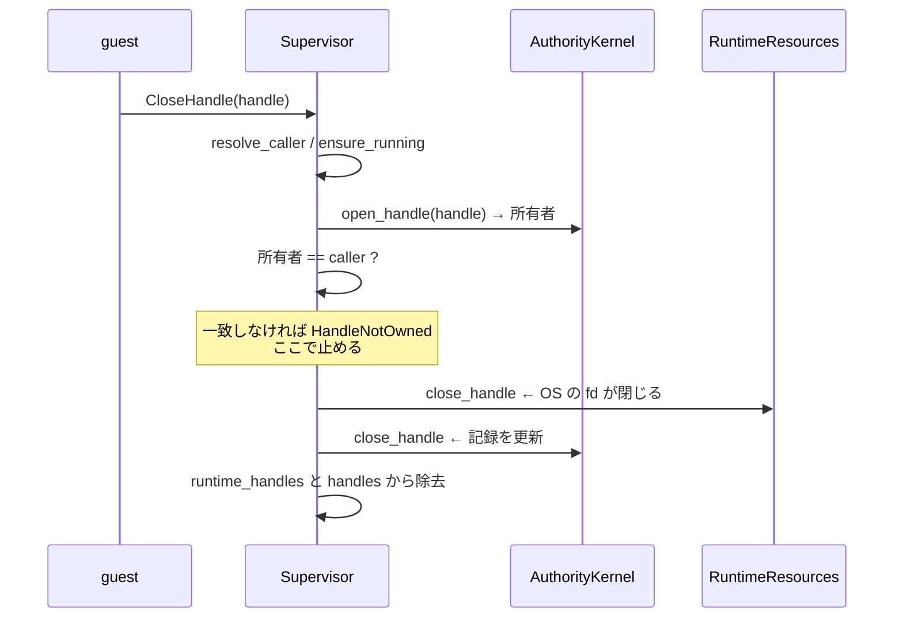

<!-- doc-type: concept -->

# handle の lifecycle

[Supervisor adapter](README.md) / handle の lifecycle

> **対象読者:** open handle を扱う実装者、descriptor の漏れをレビューする人

[`supervisor.rs`](../../crates/supervisor/src/supervisor.rs) の handle 経路は、OS の descriptor と Authority Core の記録という 2 つの世界を同期させる。両者がずれる場面があり、そのずれ方が意図されている。

## 何を防ぎたいのか

**別 subject の descriptor を閉じさせない。** `close_handle` は `resources.close_handle` を呼ぶ。呼んだ時点で OS 上の fd は閉じる。

所有権の検査は、その呼び出しの**前**になければならない。

```rust
let open_handle = self.kernel.open_handle(handle)...;
if open_handle.subject() != &caller {
    return Err(SupervisorError::HandleNotOwned { caller, handle: handle.clone() });
}
self.resources.close_handle(...)?;   // ここで初めて OS を触る
self.kernel.close_handle(...)?;
```

Authority Core 側にも所有権検査があるが、それは kernel の bookkeeping に対するもので、adapter の呼び出しより後に走る。**この 1 つの `if` が、別 subject の file / capfs descriptor と guest の間にある唯一の壁。**

所有者は kernel から読む。supervisor 自身の `issued_handles` からではない。



## `open_handle` の順序が漏れを防ぐ

```text
1. resolve_caller
2. ensure_running
3. issued_handles に既にあれば StaleHandle
4. resources.open_handle
5. issued_handles と runtime_handles に insert
6. kernel.register_open_handle
7. 6 が失敗したら resources.close_handle で補償
8. record.handles に insert
```

3 が 4 より前なのは、replay された ID で 2 回目の OS open が走らないようにするため。

**5 が 6 より前なのが漏れ対策の核心。** bookkeeping を kernel 登録の成功後にすると、登録が失敗し、しかも補償の `close_handle` も失敗した場合に、OS 上は開いている handle が `runtime_handles` に入らない。shutdown の loop は `runtime_handles` を回るので、その handle は二度と閉じられない。

先に入れておけば、補償が失敗しても shutdown が拾う。`failed_handle_registration_retains_runtime_cleanup_and_reserves_id` がこの経路を固定している。

逆に 6 が 4 より前だと、adapter が開いていない handle に対して authority を登録することになり、存在しない descriptor に対する effect を kernel が認可する。

8 が 6 の後なのは、`handles` の意味を「kernel が live だと信じている handle」に保つため。shutdown はこの集合を見て `kernel.close_handle` を呼ぶかどうかを決める。

## 2 つの集合を必ず一緒に動かす

`record.runtime_handles` と `record.handles` は別の集合で、意味が違う。

| 集合 | 意味 | 使う場所 |
|---|---|---|
| `runtime_handles` | adapter が開いている | shutdown の loop が回る対象 |
| `handles` | kernel が live だと信じている | `kernel.close_handle` を呼ぶかの判定 |

**`handles` にあって `runtime_handles` に無い handle は、shutdown の loop から見えない。** その結果 `kernel.close_handle` が呼ばれず、`finish_subject_close` が `SubjectHasOpenHandles` で永久に失敗する。subject は `Closing` に固着する。

`open_handle` の step 7 は、補償が成功したとき `runtime_handles` からだけ削除する。これは意図的な非対称。

## 2 つの永久予約表がある

`HandleId` は再利用しない（[ADR 0006](../decisions/0006-never-reuse-object-node-and-capability-ids.md)）。予約表が 2 つある。

- supervisor の `issued_handles`
- `CapabilityState` の `issued_handle_owners`

**この 2 つは意図的に食い違う。** kernel 登録が local insert の後に失敗した場合、supervisor は予約済み、kernel は別 subject の所有として記録済み、という状態になる。

失敗時に local entry を消す「明らかな cleanup」を入れると、その ID が local では再び使えるようになる一方、kernel は永久に拒否する。retry すると kernel 側で失敗する。

`issued_handles` は `BTreeMap<HandleId, SubjectId>` だが、**value は書かれるだけで読まれない。** 使われるのは `contains_key` だけ。所有権は kernel から読む。`close_handle` を `issued_handles` を見る形に書き換えると compile も既存 test も通るが、権威ある記録を supervisor の私的な表で置き換えることになる。両者が食い違う経路があることは test で示されている。

## `close_handle` は失敗しても状態を変える

kernel が `AlreadyClosed` を返した場合、`close_handle` は `StaleHandle` を `Err` で返す。**しかしその前に両方の集合から entry を除去している。**

`Err` を「何も起きなかった」と読むのは誤り。kernel が既に閉じていた handle について、supervisor 側の記録を kernel に合わせる操作が済んでいる。

## 何が助かるのか

descriptor が漏れる経路が 1 つに絞られている。`runtime_handles` に入っていれば shutdown が拾う。入れる操作が adapter 呼び出しの直後にあるので、漏れは「入れ忘れ」としてしか起きない。

所有権の判定が kernel の記録だけを見るので、supervisor 側の表が壊れても別 subject の fd は閉じられない。

## 正確な保証範囲

- OS の descriptor が実際に閉じることは確認していない。`FakeResources` は event log で、close 要求を記録するだけ。
- `HandleId` の非再利用は 1 supervisor session 内でのみ成り立つ。`issued_handles` は process 内の状態で、restart で消える。
- kernel と supervisor の予約表が食い違う経路は 1 つだけ test されている。他の食い違い方は未検証。
- `handles` にあって `runtime_handles` に無い状態を作る test が無い。この状態が subject を `Closing` に固着させることは、コードから読める性質であって検証済みではない。
- shutdown 中の `close_handle` 失敗は未検証。
- `issued_handles` と `subjects` は追記のみで、上限が無い。長期稼働の session では memory が単調に増える。

## 変更時の確認点

- 所有権検査を `resources.close_handle` の後ろへ動かさない。別 subject の fd が閉じてから拒否することになる。
- 所有者を `issued_handles` から読む形に変えない。value は書かれるだけで読まれない設計で、権威は kernel にある。
- `runtime_handles` と `handles` を別々に更新する箇所は、insert / close / shutdown の 4 箇所すべてを揃えて直す。`open_handle` の補償だけが片方を削るのは意図。
- kernel 登録の失敗時に `issued_handles` から entry を消さない。local だけ再利用可能になり、kernel は永久に拒否する。
- `close_handle` の `AlreadyClosed` 分岐で、集合の除去を止めない。kernel との整合が取れなくなる。

## 関連

- [Supervisor adapter](README.md)
- [subject の setup と shutdown](subject-lifecycle.md)
- [誰の要求として扱うか](caller-identity.md)
- [検証対応表](verification.md)
- [Subject lifecycle と open handle](../authority-core/subject-lifecycle-and-handles.md)
- [0006](../decisions/0006-never-reuse-object-node-and-capability-ids.md)
- [用語集](../glossary.md)
