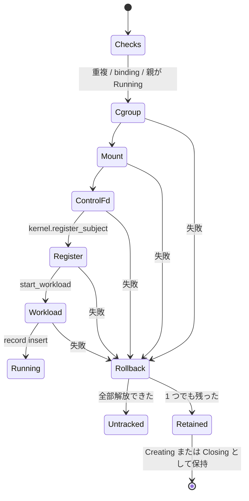

<!-- doc-type: concept -->

# subject の setup と shutdown

[Supervisor adapter](README.md) / subject の setup と shutdown

> **対象読者:** subject lifecycle を触る実装者、resource 解放をレビューする人

[`supervisor.rs`](../../crates/supervisor/src/supervisor.rs) は subject の setup を rollback 可能な transaction として実行し、shutdown を「authority を先に落とし、resource は依存の逆順に解放する」順序で進める。syscall は 1 つも呼ばない。cgroup、mount、control fd、workload はすべて `RuntimeResources` に委ねる。

## setup の順序

```text
1. 重複 subject を拒否
2. callers.resolve(&connection)
3. bound_subject == subject_id
4. 親が Running か
5. resources.create_cgroup
6. resources.mount_capfs
7. resources.open_control_fd
8. kernel.register_subject
9. resources.start_workload
10. SubjectRecord を Running として insert
```

1〜4 は純粋な検査で、順序は入れ替えても error の種類が変わるだけ。5〜7 が 9 より前なのは、`start_workload` が 3 つの token を全部消費するから。

**8 が 9 より前なのは意図的。** 逆にすると、live な workload が control fd と capfs mount を掴んでいる状態で、kernel には Running の subject が存在しないことになる。その workload が試みる認可はすべて拒否され、rollback は kernel が知らない process を止めることになる。

その代わりに逆向きの window ができる。step 8 と 9 の間、subject は共有 kernel 上で Running だが workload はまだ起動していない。同じ `CapabilityKernel` を持つ他のコンポーネントは、この間に effect を認可できる。**これは意図した窓であり、test されていない。**

10 が最後なのは、`Running` の record を先に入れると、workload の起動に失敗して token を rollback 済みの subject に対して `ensure_running` が通ってしまうから。



## rollback が全部片付いたら record を残さない

`rollback_setup` が全 resource を解放できた場合、supervisor は record を insert しない。その `SubjectId` は supervisor から見て未知になる。

しかし `CapabilityState` は subject を永久に覚えている。`finish_subject_close` は status を変えるだけで entry を消さない。

**結果として、同じ `SubjectId` で `create_subject` を再実行すると、重複検査（step 1）を通り、cgroup と mount と control fd を確保してから step 8 の `RegisterSubject` で失敗する。** supervisor が忘れて kernel が覚えている、という食い違いがここに出る。

逆に、1 つでも解放できなかった場合は record を残す。lifecycle は `authority_registered` で決まる。

| 状態 | lifecycle |
|---|---|
| kernel 登録済み | `Closing` |
| kernel 未登録 | `Creating` |

残さないと、漏れた cgroup / mount / control fd に対応する record が無く、`shutdown_subject` が `UnknownSubject` を返して、その session の間ずっと token に到達できなくなる。

## shutdown の順序

```text
1. Closed なら拒否
2. record.lifecycle = Closing
3. kernel.begin_subject_close（authority_registered のとき）
4. token と runtime_handles を snapshot
5. resources.stop_workload
6. resources.close_control_fd
7. 各 runtime handle: resources.close_handle → kernel.close_handle
8. resources.unmount_capfs   ← workload 停止 && control 閉鎖 && handle 全閉鎖
9. resources.remove_cgroup   ← workload 停止 && mount 解除
10. kernel.finish_subject_close（失敗が 0 件のとき）
11. record.lifecycle = Closed
```

**3 が 5 より前なのが要点。** `begin_subject_close` は subject が保持する全 capability を revoke し、authorization epoch を進める。workload を先に止めると、停止と競合する in-flight request が、まだ revoke されていない capability で認可を通る窓ができる。

8 の gate は 3 条件の AND。workload が動いている間や descriptor が開いている間に unmount すると、adapter が `EBUSY` で失敗するか、live な process の下から filesystem を引き抜く。9 の gate は 2 条件。mount が残ったまま cgroup を消すと、その mount を使っている process から containment が消える。

7 の内部順序も効く。resource close が先、kernel close が後。逆にすると、kernel が閉じた後に resource close が失敗した場合、authority 上は閉じているのに fd が開いたまま `finish_subject_close` が完了する。

## 部分的な失敗は `Closing` に留まる

どれか 1 つでも失敗すると `CleanupFailed` を返し、lifecycle は `Closing` のまま。`Closed` になるのは全 phase が成功したときだけ。

`Closed` は不可逆で、`shutdown_subject` は `Closed` を拒否する。したがって未解放の resource があるまま `Closed` にすると、その resource は session の間ずっと到達不能になる。

retry は自動で行わない。`CleanupFailed` を 1 回返すだけで、再度 `shutdown_subject` を呼ぶのは host の責務。

**step 2 が step 3 より前にあることの副作用がある。** `begin_subject_close` が失敗すると `?` で早期 return するが、その時点で lifecycle は既に `Closing`。revoke は起きておらず、resource も触っていないのに、subject は永久に非 Running になる。別の `shutdown_subject` 呼び出しでしか前に進めない。

## `SubjectLifecycle` と `SubjectStatus` は別物

supervisor が持つ `SubjectLifecycle` と、Authority Core の `SubjectStatus` は別の enum で、正当に食い違う。

- 保持された record が `Creating` で、kernel には subject が存在しない。
- record が `Closing` で、kernel では既に `Closed`。

どちらかを判別する field は `record.authority_registered` だけで、これが `begin_subject_close` と `finish_subject_close` を呼ぶかどうかを単独で決めている。

## 何が助かるのか

失敗時に host へ何が残るかが、record の token field で分かる。`workload` / `control` / `mount` / `cgroup` の `Option` を見れば、まだ解放していないものが列挙できる。

gate が条件式として書かれているので、「なぜまだ unmount しないのか」がコードから読める。log を追う必要がない。

## 正確な保証範囲

- syscall を 1 つも呼ばない。`FakeResources` は `Vec<&'static str>` の event log で、順序を確認するだけ。process が止まったこと、mount が消えたことは一切確認していない。
- `CleanupStep::FinishClose` と `CleanupStep::BeginClose` を通る test が無い。kernel が `finish_subject_close` を拒否する経路、および step 3 の `?` で subject が止まる経路は完全に未検証。
- cleanup 失敗の形は 2 つしか test されていない（unmount と close_control）。`stop_workload` 失敗、`remove_cgroup` 失敗、shutdown 中の `close_handle` 失敗、複数 phase の同時失敗は未検証。
- 親の gate は Running の成功経路しか通っていない。`Creating` / `Closing` / `Closed` / 未知の親は未検証。
- 並行性の test が無い。`Supervisor` は `&mut self` で単一 thread だが、`AuthorityKernel` の method は `&self` を取り、`CapabilityKernel` は内部で lock を持つ。同じ kernel を共有する別コンポーネントが supervisor の step の間に状態を変えられる。step 8〜9 の窓は特にそう。
- clean rollback 後に同じ `SubjectId` を作り直す経路（supervisor 忘却 / kernel 記憶の食い違い）は未検証。
- adapter の error は失敗地点で `to_string()` され、型が落ちる。`CleanupFailure` と `SetupFailed` は `String` しか持たないので、呼び出し側は `EBUSY` と `EPERM` を区別して retry を判断できない。

## 変更時の確認点

- step 8 と 9 の順序を入れ替えない。kernel が知らない workload を rollback することになる。
- shutdown の step 3 を step 5 の後ろへ動かさない。停止と競合する request が live な capability で通る。
- unmount の gate から `handles_closed` を外さない。`rollback_setup` 側の gate にはこの項が無いが、それは setup 中に handle が存在しないから。**setup が handle を開くようになったら、両方の gate を同時に直す。**
- `record.subjects` から entry を消さない。`DuplicateSubject` が `SubjectId` の再利用を永久に禁止しているのは意図的で、消すと `Closed` 後に同じ ID を作れてしまう。
- `resources_mut()` を production から呼ばない。無制限の `&mut R` を返し、この file の gate を全部迂回する。
- adapter error の型を残したい場合、`CleanupFailure` と `SetupFailed` の `String` を typed error に変える必要がある。retry の判断材料が無いのは現在の制約。

## 関連

- [Supervisor adapter](README.md)
- [誰の要求として扱うか](caller-identity.md)
- [handle の lifecycle](handle-lifecycle.md)
- [wire protocol](wire-protocol.md)
- [検証対応表](verification.md)
- [Subject lifecycle と open handle](../authority-core/subject-lifecycle-and-handles.md)
- [Capability state](../authority-core/capability-state.md)
- [用語集](../glossary.md)
