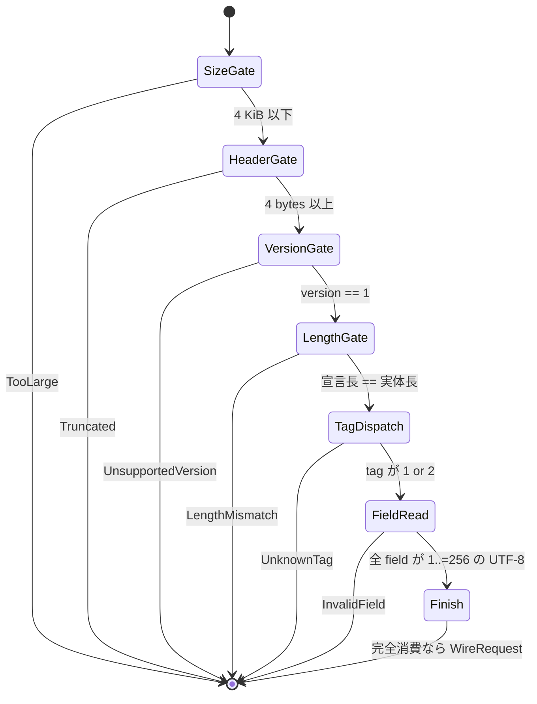

<!-- doc-type: contract -->

# wire protocol

[Supervisor adapter](README.md) / wire protocol

> **対象読者:** guest 側 control channel の実装者、decoder をレビューする人

[`protocol.rs`](../../crates/supervisor/src/protocol.rs) が定める、supervisor の control datagram の形式。datagram 指向で、1 datagram = 1 request。`SOCK_SEQPACKET` を前提にしている。

## datagram の形

```text
[version u8][tag u8][body_len u16 big-endian][body ...]
```

| 項目 | 規約 |
|---|---|
| `PROTOCOL_VERSION` | `1` 固定。他の値は `UnsupportedVersion(byte)` |
| `HEADER_BYTES` | `4`。これ未満は `Truncated` |
| `MAX_WIRE_REQUEST_BYTES` | `4 * 1024`。超過は `TooLarge { actual }` |
| `MAX_WIRE_RESPONSE_BYTES` | `64`。response も同じ header と bounded datagram を使う |
| body 長 field | `u16` big-endian。宣言と実体が一致しなければ `LengthMismatch { declared, actual }` |
| trailing bytes | 許さない。`TrailingBytes` |

**上限検査は decode の 1 行目にある。** header の index を取る前、version を見る前、field を読む前。ここが最初でないと、guest が制御する長さで走査が始まる。body 長が `u16` なので 65539 bytes の datagram でも `LengthMismatch` までは進めてしまい、4 KiB の天井だけが 1 request あたりの作業量を縛っている。

header 長の検査も index の前にある。`bytes[0]` と `bytes[2..4]` は直接の slice index なので、3 bytes の datagram で panic する。`#![forbid(unsafe_code)]` は memory 安全性を守るが、guest が起こす panic は止めない。

## `WireRequest`

閉じた union。tag 1 と 2 だけが request になり、他は `UnknownTag(byte)`。

| tag | variant | field 順 |
|---|---|---|
| `1` | `CloseSubject { claimed_subject }` | subject claim |
| `2` | `CloseHandle { claimed_subject, handle }` | subject claim → handle |

`claimed_subject` は **untrusted claim** で、認可には使われない。詳細は[誰の要求として扱うか](caller-identity.md)。

wire tag が無い操作: `issue_root`、`derive`、`revoke`、`open_handle`。これらは host API からのみ呼べる。tag を足すことは、その操作を guest に開放することと同義になる。

## 文字列 field

| 項目 | 規約 |
|---|---|
| 形式 | `u16` big-endian の長さ prefix + UTF-8 bytes |
| `MAX_FIELD_BYTES` | `256`。**byte 数であって文字数ではない** |
| 空 | 許さない。長さ 0 は `InvalidField(name)` |
| 不正 UTF-8 | `InvalidField(name)` |
| 範囲外 | `checked_add` と `slice::get` で `InvalidField(name)` |

`SubjectId::new` と `HandleId::new` は検証しない `Self(value.into())` である。**この decoder が、空文字列や無制限長の identity を kernel の `BTreeMap` key に入れない唯一の場所。**

field が最大 2 つなので body の最大は `2 * (2 + 256) = 516` bytes。encode 側で 4 KiB の上限に当たることはない。

request の field 上限、4 KiB ちょうどの datagram size gate、truncated frame、length mismatch、型付き request 後の `TrailingBytes` は module test で確認している。

## `WireResponse`

`DispatchResponse` は `WireResponse` に変換され、response も同じ 4-byte header と closed tag set で encode/decode される。`SubjectClosed` と `HandleClosed` は空 body、`Refused` は 1-byte の `RefusalCode` を持つ。response は最大 64 bytes で、subject ID、handle ID、自由形式の error text を運ばない。

## `WireEncodeError`

| variant | いつ |
|---|---|
| `EmptyField(name)` | 空文字列を encode しようとした |
| `FieldTooLarge(name)` | 256 bytes 超 |
| `TooLarge` | 合計が 4 KiB 超。現在の field 数では到達しない |

## `WireDecodeError`

| variant | いつ | retry |
|---|---|---|
| `TooLarge { actual }` | 4 KiB 超 | しない |
| `Truncated` | 4 bytes 未満 | しない |
| `UnsupportedVersion(u8)` | version が 1 でない | しない |
| `LengthMismatch { declared, actual }` | 宣言長と実体が不一致 | しない |
| `UnknownTag(u8)` | tag が 1 でも 2 でもない | しない |
| `InvalidField(name)` | 空・超過・範囲外・不正 UTF-8 | しない |
| `TrailingBytes` | 型付き request の後に bytes が残る | しない |

すべて同じ入力で必ず再現する。`SupervisorError::Wire` として上位へ渡る。

検査の順序は固定されている。version が tag より先なので、`[2, 99, 9, 9]` は `UnknownTag(99)` ではなく `UnsupportedVersion(2)` になる。version 検査が後ろにあると、v2 の datagram の 2 byte 目がたまたま 1 か 2 のとき、v1 の layout で読まれる。v2 の `CloseHandle` 相当が v1 の `CloseSubject` として実行され、handle 1 つを閉じるつもりが subject 全体を落とす。



## 保証範囲外

- 認可。decoder は形だけを見る。誰の要求かは connection から決める。
- guest VM 内の agent process と supervisor の接続を含む end-to-end transport。実 `SOCK_SEQPACKET`、`SO_PEERCRED`、bounded datagram 送受信そのものは control socket module test で確認している。
- version 交渉。`PROTOCOL_VERSION` は 1 固定で、negotiation の経路が無い。

## 関連

- [Supervisor adapter](README.md)
- [誰の要求として扱うか](caller-identity.md)
- [subject lifecycle](subject-lifecycle.md)
- [検証対応表](verification.md)
- [0012](../decisions/0012-check-frame-length-before-allocating-the-payload.md)
- [用語集](../glossary.md)
