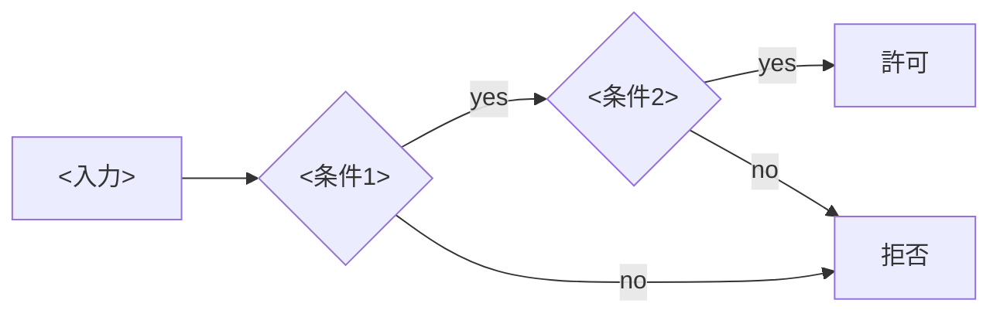

<!-- doc-type: concept -->

# <守っている不変条件の名前>

[<親ページ名>](README.md) / <このページ名>

> **対象読者:** <どの境界を触る人か。「実装者」だけでは足りない>

このページは [`crates/<crate>/src/<module>.rs`](../../crates/<crate>/src/<module>.rs) が、<何をどう判定し、何を保証するか>を説明する。

## 何を防ぎたいのか

<具体的な失敗シナリオを、実際の値で書く。「権限が漏れる」ではなく、どの入力でどの境界を越えるのかを書く。>

<正常系と拒否系を並べる。>

```text
親: <具体値>
安全な子: <具体値>
拒否する子: <具体値。なぜ拒否するか>
```



## <中核概念>はどう決まるか

<1 概念 1 節。節の数は内容次第。見出しは読者の疑問文にする。>

## <別の中核概念>はどう決まるか

<例: 「なぜ ObjectId は path ではないのか」「revoke はどの時点から効くのか」>

## 何が助かるのか

<この構造によって、レビューで確認しなくてよくなったことを書く。「安全になる」ではなく「何を確認せずに済むか」。>

## 正確な保証範囲

<このページの主張が及ぶ範囲を明示する。>

<次は保証しない、として列挙する。>

- <対象外の項目と、それをどのページが担当するか>
- <mock / fake を使った箇所>
- <特権操作・外部サービス・実 VM を伴うため未検証の箇所>

## 変更時の確認点

- <この構造を変えるとき、同時に見直す Rust / Lean / test / 他ページ>
- <破ってはいけない不変条件>

## 関連

- [<兄弟ページ>](.md)
- [<対応する設計ページ>](../design/.md)
- [<関連する決定記録>](../decisions/.md)
- [用語集](../glossary.md)

