<!-- doc-type: contract -->

# <契約の名前>

[<親ページ名>](README.md) / <このページ名>

> **対象読者:** <この trait / wire format を実装する人、その境界のレビュー担当者>

このページは [`crates/<crate>/src/<module>.rs`](../../crates/<crate>/src/<module>.rs) が要求する <trait 群 / メッセージ形式> の義務を定める。設計上の理由は <対応する概念ページ> を参照する。実機 gate の成立や外部 provider の成功はこの契約から導かれない。

## <trait 名 / メッセージ名>

<1 行で責務を書く。以降は表で書く。散文にしない。>

| 項目 | 規約 |
|---|---|
| 入力型 | `<Rust の型名>` |
| 出力型 | `<Rust の型名>` |
| 事前条件 | <呼び出し側が保証すること> |
| 事後条件 | <実装側が保証すること> |
| 上限 | <数値と単位> |
| 失敗 | `<Error enum の variant>`。<retry 可否> |

<順序が固定されている場合は番号付きリストか図で示す。>

```mermaid
stateDiagram-v2
    [*] --> <状態1>
    <状態1> --> <状態2>: <commit する effect>
    <状態2> --> [*]
```

## <別の trait 名 / メッセージ名>

| 項目 | 規約 |
|---|---|
| | |

## 保証範囲外

<この契約が保証しないことを列挙する。>

- <実装側の責務ではない項目と、それを誰が持つか>

## 関連

- [<対応する概念ページ>](.md)
- [<検証対応表>](verification.md)
- [用語集](../glossary.md)
